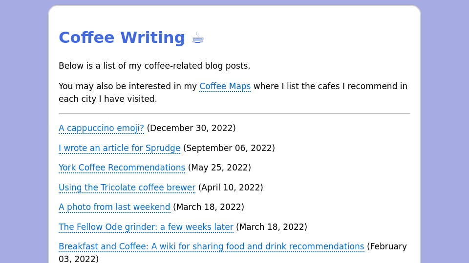

# Screenshots

An application that, given a URL, will take a screenshot of the page and save it to a file.

## Example Screenshot

## Usage

To request a screenshot of a page, make a GET request to the application with the URL of the page you want to screenshot as the `url` parameter:

    GET /?url=https://jamesg.blog

This will return an image file of the top of the viewport.

## Process

When a request is received, this application:

1. Validates the URL to make sure the host name is in an allowed list of domains.
2. Checks if a screenshot of the page has already been taken.
3. If a screenshot has already been taken, it is returned.
4. If a screenshot has not been taken, the page is loaded in a headless browser and a screenshot is taken.
5. The screenshot is saved to a file.
6. The screenshot is returned to the user.

This application uses [Puppeteer](https://pptr.dev/) to take the screenshot.

## Installation

To install this project, clone the repository and run `npm install`:

    git clone https://github.com/capjamesg/screenshots
    cd screenshots
    npm install

To run the project, execute the following command:

    npm start

This will run the project at `http://localhost:9005`.

## Technologies Used

- [Puppeteer](https://pptr.dev/)
- Express
- Node.js

## License

This application is licensed under an MIT No Attribution license. See the [LICENSE](LICENSE) file for more information.

## Contributors

- capjamesg